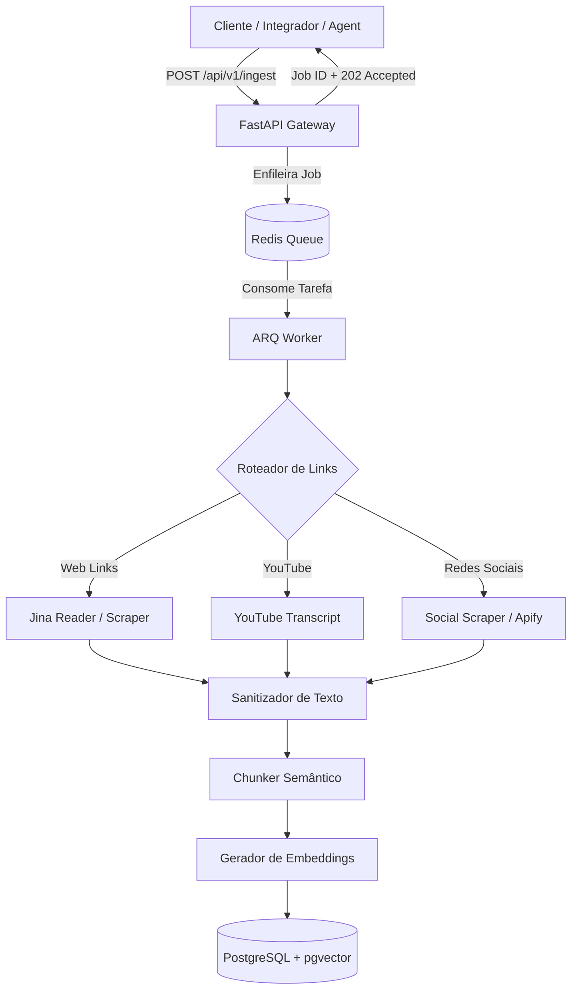

# 🔗 Link-to-RAG (Link-to-Text Ingestion & RAG Engine)

[](https://www.python.org/)
[](https://fastapi.tiangolo.com/)
[](https://www.docker.com/)
[](https://github.com/pgvector/pgvector)
[](https://redis.io/)

Microsserviço de alta performance desenvolvido em **FastAPI** para ingestão assíncrona, extração de texto limpo, geração de embeddings e chunking vetorial a partir de qualquer URL (websites, artigos, YouTube e redes sociais), pronto para alimentações em sistemas de RAG (*Retrieval-Augmented Generation*) e Agentes de IA.

---

## 🚀 Funcionalidades Principais

- **📌 Ingestão Universal de Links:** Suporte a extração de conteúdo de páginas web gerais, transcrição de vídeos do YouTube e postagens de redes sociais.
- **⚡ Arquitetura Assíncrona & Resiliente:** API Gateway de alta velocidade com resposta imediata (`HTTP 202 Accepted`) e fila de tarefas alimentada por **Redis + ARQ**.
- **🧹 Sanitização & Limpeza:** Filtro avançado de conteúdo que remove elementos irrelevantes (UI, menus, scripts, propagandas) e entrega texto formatado em Markdown limpo.
- **🧩 Chunking Inteligente:** Divisão otimizada do texto em fragmentos (*chunks*) com janela deslizante e *overlap* configurável para maximizar o contexto semântico.
- **🤖 Embeddings & Vector Search (pgvector):** Suporte nativo para geração de embeddings (ex: OpenAI `text-embedding-3-small`) e busca vetorial por similaridade no **PostgreSQL (pgvector)**.
- **🛡️ Circuit Breakers & Retries:** Tratamento de falhas e resiliência em scrapers e APIs de extração.

---

## 🛠️ Tecnologias Utilizadas

- **Linguagem & Framework:** Python 3.11+, FastAPI, Pydantic v2
- **Fila Assíncrona & Worker:** ARQ, Redis 7
- **Banco de Dados & Busca Vetorial:** PostgreSQL 16 com `pgvector`, SQLAlchemy 2.0 (Async)
- **Extratores & Scrapers:** Jina AI Reader API, YouTube Transcript API, Apify SDK
- **Containerização:** Docker & Docker Compose
- **Testes:** Pytest, Pytest-Asyncio

---

## 🏛️ Arquitetura do Sistema



---

## 📂 Estrutura de Pastas

```text
link_to_rag/
├── app/
│   ├── api/             # Endpoints FastAPI (ingest, jobs, search)
│   ├── core/            # Configurações, logs e circuit breaker
│   ├── db/              # Conexão assíncrona com PostgreSQL/SQLAlchemy
│   ├── extractors/      # Roteador e extratores (Web, YouTube, Social)
│   ├── models/          # Modelos de dados e tabelas pgvector
│   ├── schemas/         # Schemas de validação Pydantic
│   ├── services/        # Serviços de chunker, embeddings, cleaner e busca
│   ├── main.py          # Ponto de entrada FastAPI
│   └── worker.py        # Worker assíncrono ARQ
├── tests/               # Suíte de testes unitários e de integração
├── Dockerfile           # Imagem da aplicação Python
├── docker-compose.yml   # Orquestração de serviços (API, Worker, DB, Redis)
└── requirements.txt     # Dependências do projeto
```

---

## ⚙️ Como Executar o Projeto

### Pré-requisitos
- [Docker](https://www.docker.com/) e [Docker Compose](https://docs.docker.com/compose/) instalados.

### 1. Clonar o repositório
```bash
git clone https://github.com/econs1312/link_to_rag.git
cd link_to_rag
```

### 2. Configurar Variáveis de Ambiente
Crie um arquivo `.env` baseado no `.env.example`:
```bash
cp .env.example .env
```

Ajuste as chaves no `.env` (ex: `OPENAI_API_KEY`, `JINA_API_KEY`):
```env
OPENAI_API_KEY=sua-chave-openai
JINA_API_KEY=sua-chave-jina
DATABASE_URL=postgresql+asyncpg://postgres:postgres@db:5432/link_to_rag
REDIS_URL=redis://redis:6379/0
```

### 3. Iniciar os Containers
Execute o Docker Compose para compilar e iniciar todos os serviços:
```bash
docker compose up -d --build
```

Os seguintes serviços estarão rodando:
- **API (FastAPI)**: `http://localhost:8000`
- **Documentação Swagger**: `http://localhost:8000/docs`
- **PostgreSQL com pgvector**: `localhost:5432`
- **Redis**: `localhost:6379`

---

## 🧪 Executando os Testes

Para rodar a suíte de testes com `pytest` dentro do container Docker:

```bash
docker compose exec api pytest
```

---

## 📌 Principais Endpoints

| Método | Endpoint | Descrição |
|---|---|---|
| `POST` | `/api/v1/ingest` | Envia uma URL para ingestão e gera um `job_id` |
| `GET` | `/api/v1/jobs/{job_id}` | Consulta o status do processamento do job |
| `POST` | `/api/v1/search` | Realiza busca por similaridade vetorial nos documentos |

---

## 📜 Licença

Este projeto está sob a licença [MIT](LICENSE).